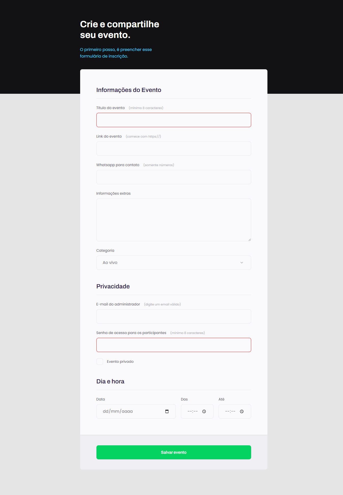

  <h1 align="center"> Explorer Stage 03 - Formulários 📝</h1>

## 💻 Projeto 03
> Esse projeto simples consiste na criação de um formulário que simula o preenchimento de dados para um evento. 📆

## 🚀 Tecnologias

  
  

 

[🔗 Clique aqui para acessar o projeto](https://brunakarina.github.io./Projeto-03/)

## 📫 Contato

  
  

